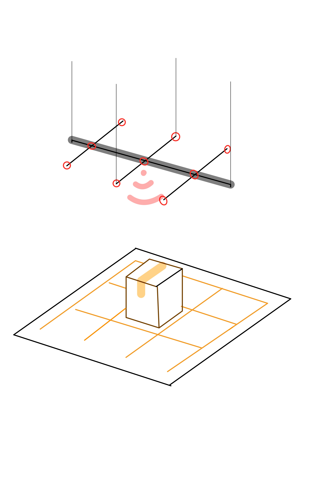
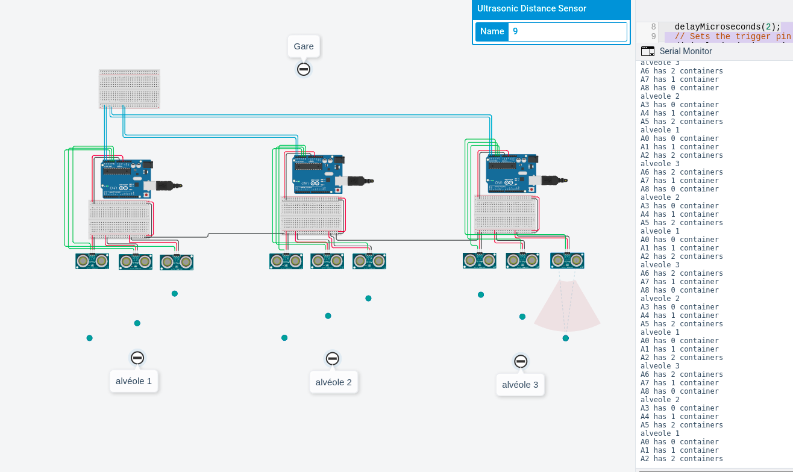
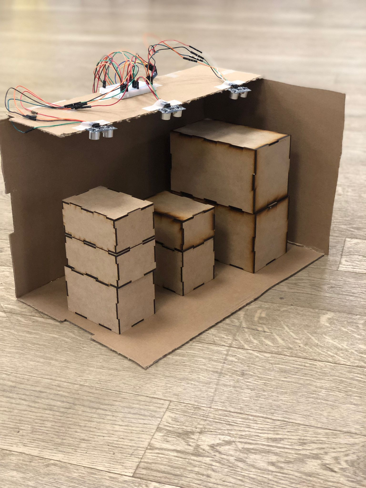

# CPI-2021-PoC
PoC for Stellantis during CPI 2021-2022

## What is the CPI ?

CPI is a program made by [Schoolab](https://theschoolab.com/old/cpi-creation-of-an-innovative-project/).
It consists of a multidisciplinary group of students working on a project.
The project is given by a company (for instance, our project was given by Stellantis).
The students come from different colleges (my group is composed of Strate, Paris-1, CentraleSupélec and Epitech students).

## Stellantis

[Stellantis](https://en.wikipedia.org/wiki/Stellantis) is a multinational automotive manufacturing corporation formed in 2021

## Project

Stellantis asked us to find a solution to: **How to improve the industrial mobility of Vesoul's factory ?**

### 1. Vesoul's factory

[Vesoul's factory](https://fr.wikipedia.org/wiki/Usine_Stellantis_de_Vesoul) is Europe's biggest spare part factory.

### 2. The issue

Being such a big factory, it has its own set of problems, one of them is that people who transport the containers from one station to another mainly rely on sight.

As such, stations may overflow when there are too many containers in one station, endangering the road transporters use to move containers.

## Solution

We noticed that current monitoring tools used in Vesoul's factory weren't running in real time.

The proposed solution was a tool that allowed real time monitoring of the stations(Gare), more specifically, the subparts(alvéole) that composed each station.

Each subpart(alvéole) is divided into 3 subsubparts and on each subsubpart, a sensor placed above will indicate how many containers there are(up to 2 stacked on each other). There are on average 6 containers max per subpart(alvéole).

Then, we tried testing the solution using [Tinkercad](https://www.tinkercad.com/):

Finally, we made the solution.
The PoC was made using Arduino:
- Arduino Uno
- Bread Board
- Esp8266
- Ultrasonic sensor
- tons of cable

the sensors feed the distance between the ground(or container(s)) and the sensor to the Arduino Uno which turn that distance into the number of container(s). Then it sends that data to a [Thingspeak](https://thingspeak.com/) channel.

**The finished PoC represents one subpart(alvéole).**